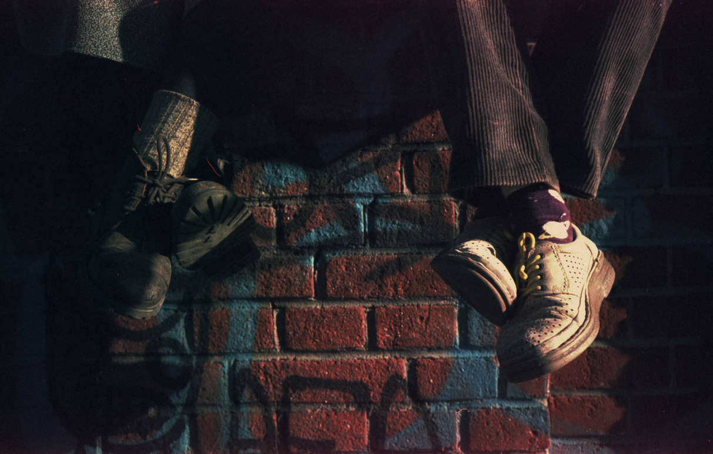

# Github flavored markdown 

## External link

This following is an [external link](https://source.unsplash.com/user/erondu). See you on the flipside. 

## Internal link

# About the Expo

This [link](#details) link will take you there.

This [link](#down) is here. On April the 10th, Hazegallery will present a new virtual exhibition, “Analogue Photography" featuring works by contemporary young artists working on film photography. 

 

Eight photographers  from different countries will represent at the exposition their works

 

Film photography took an important place in the history of photography, as well as a special genre

Despite the fact that the modern world offers a huge number of opportunities to simplify the creation of photographs, many photographers remain faithful to this genre.

(#top)

## table

| col1 | col2 | col3 |
| --- | --- | --- |
| content1 | content2 | content3 |

## here is some documentation
(click for help) [https://help.github.com/en]

## here is an image
[image link](./images/jodaman.png)

## The real picture

:poop: :poop: :poop: :poop: :poop:

# Go to top 

[link](#top)

2nd Table 
| Names  | CLass  |
|---|---|
|  |   |
